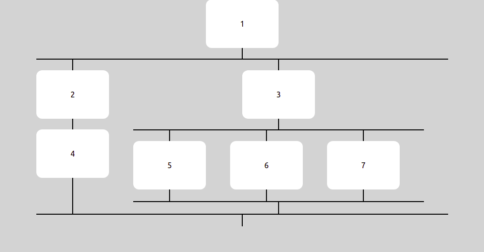

# React Path Tree

### Introduction

This component is specifically created for projects where we would want to create a tree or a graph. Recursively creates a tree UI component based on the tree data. It has the following functionalities:

1. Gives the developer control over what component is rendered at each node of the tree.
2. Can configure the gap between each branch, height of each connecting line and the color of the lines that connect each node.
3. Can be plugged into any react project easily.

Still not clear? Check the usage and the examples section to see how it works.

### Props

This library exports a `Tree` component. It has the following props:

| name       | isRequired | default value | type     | description                                                               |
| ---------- | ---------- | ------------- | -------- | ------------------------------------------------------------------------- |
| treeData   | true       | {}            | TreeData | This is the tree data. Based on this the tree structure will be rendered. |
| lineHeight | false      | 20            | number   | Height of each connecting line between two nodes stacked vertically.      |
| gapWidth   | false      | 50            | number   | Width of gap between two nodes that are horizontally placed.              |
| lineColor  | false      | black         | string   | Color of the connecting lines.                                            |

### Usage

TreeData needs to be of the following structure:

```
{
  [id]: {
    id: Id of the node. Needs to be a string,
    incomingNodes: Array of all incoming nodes.
    outgoingNodes: Array of all outgoing nodes.
    component: Component that needs to be rendered.
  }
}
```

Example:

```
import React from 'react';
import {TreeData, Tree} from 'react-path-tree';

const App = () => {
  const treeData: TreeData = {
    "1": {
      id: "1",
      incomingNodes: [],
      outgoingNodes: ["2", "3"],
      component: <DummyCard id={1} />,
    },
    "2": {
      id: "2",
      incomingNodes: ["1"],
      outgoingNodes: ["4"],
      component: <DummyCard id={2}/>,
    },
    "3": {
      id: "3",
      incomingNodes: ["1"],
      outgoingNodes: ["5", "6", "7"],
      component: <DummyCard id={3}/>,
    },
    "4": {
      id: "4",
      incomingNodes: ["2"],
      outgoingNodes: [],
      component: <DummyCard id={4}/>,
    },
    "5": {
      id: "5",
      incomingNodes: ["3"],
      outgoingNodes: [],
      component: <DummyCard id={5}/>,
    },
    "6": {
      id: "6",
      incomingNodes: ["3"],
      outgoingNodes: [],
      component: <DummyCard id={6}/>,
    },
    "7": {
      id: "7",
      incomingNodes: ["3"],
      outgoingNodes: [],
      component: <DummyCard id={7}/>,
    }
  }

  return <Tree treeData = {treeData}>
}
```

This is what is returned when we run the above code.


### Next features

- Ability to pass a custom node in between two vertical nodes.
- Logic to remove the extending line for each branch.

### Contribution

If you see any bug or any feature addition, do create something in the issues section of the repository and we can take a look. Star the project if you like it :D
